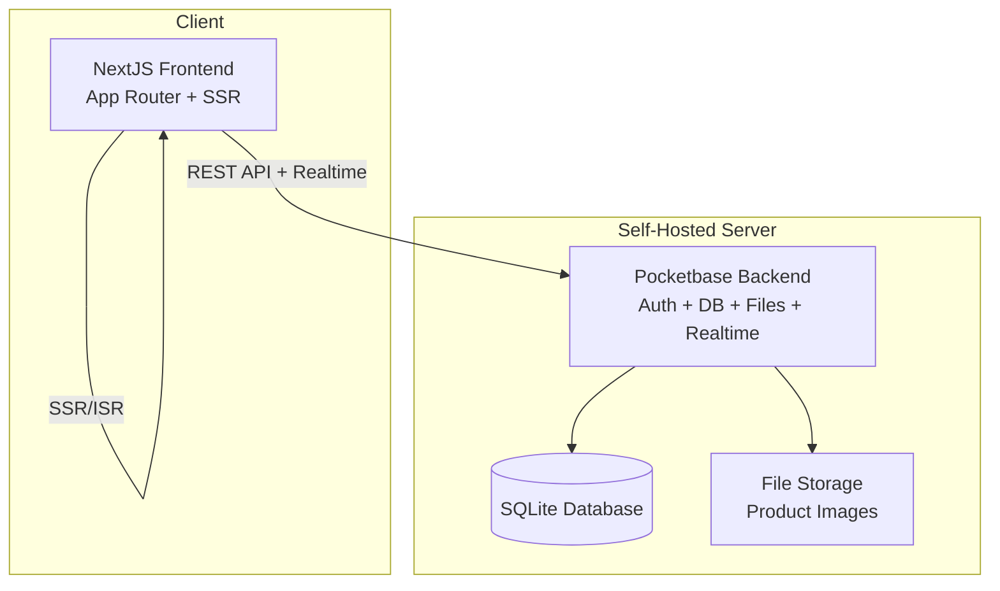
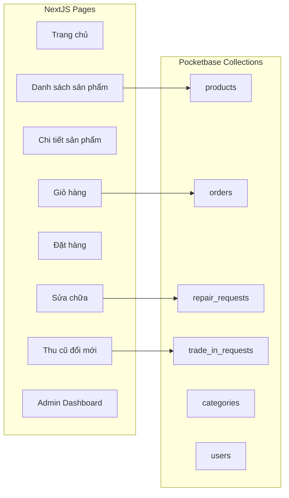
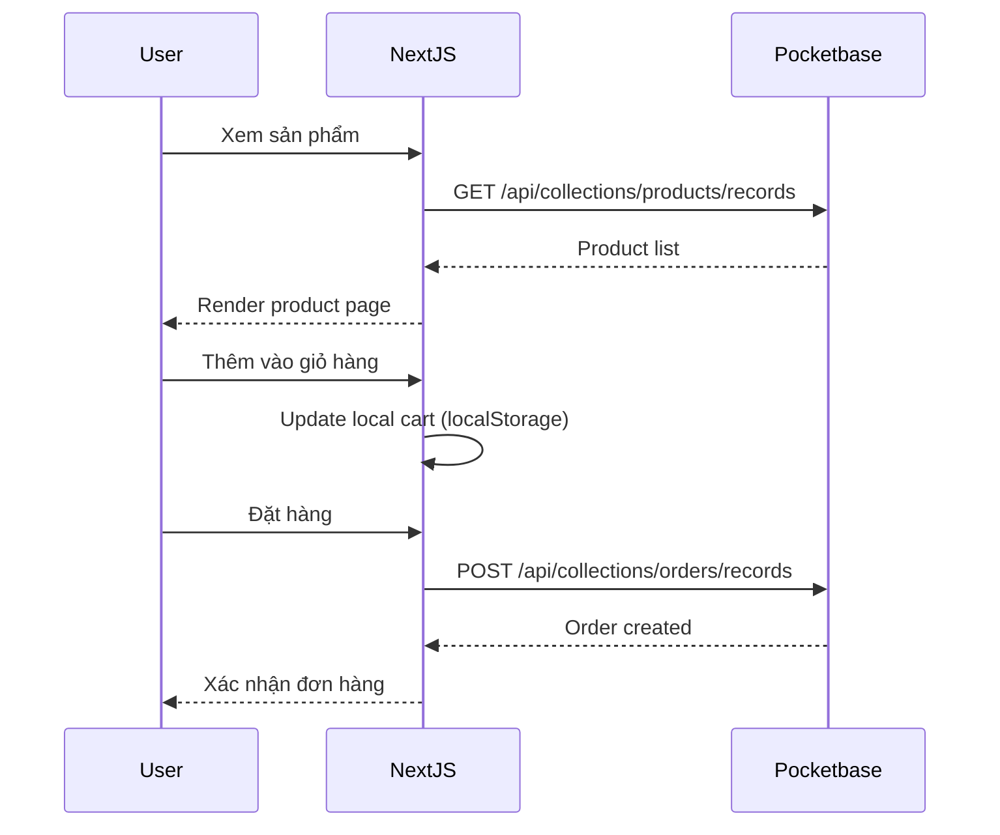
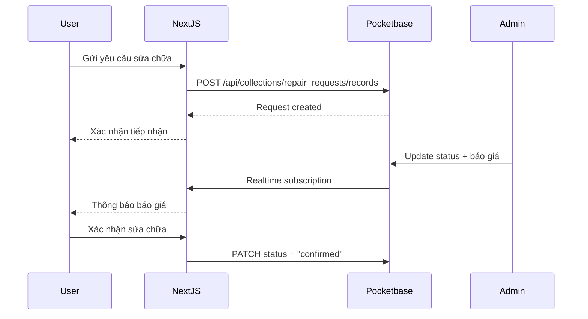
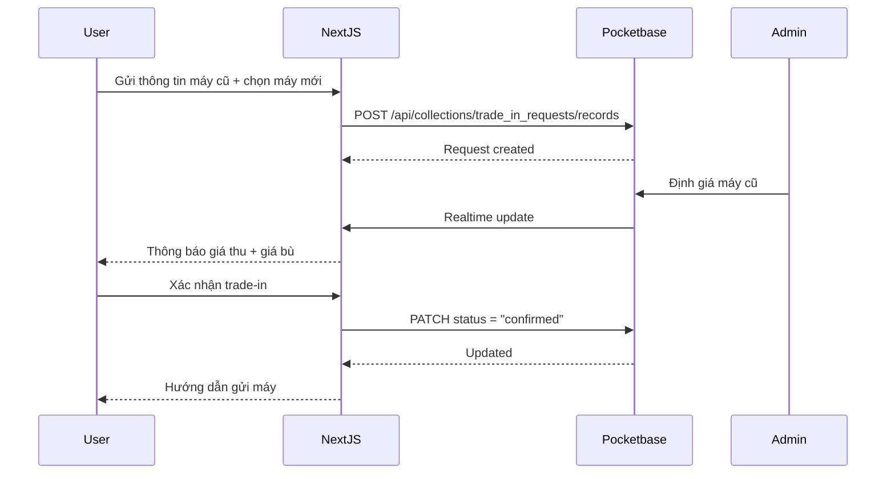

# Design Document: iPhone Store Website

## Overview

Website thương mại điện tử chuyên về iPhone, cung cấp 3 dịch vụ chính: Mua bán iPhone (mới/cũ), Sửa chữa iPhone, và Thu cũ đổi mới (trade-in). Hệ thống được thiết kế self-hosted, nhẹ, và phát triển nhanh.

Kiến trúc sử dụng Pocketbase làm backend all-in-one (authentication, database, file storage, realtime subscriptions) kết hợp NextJS 14+ App Router cho frontend. Pocketbase được chọn vì chỉ cần 1 binary file duy nhất để chạy toàn bộ backend, phù hợp cho self-hosted với chi phí thấp.

## Architecture





## Sequence Diagrams

### Luồng Mua hàng (Purchase Flow)



### Luồng Sửa chữa (Repair Flow)



### Luồng Thu cũ đổi mới (Trade-in Flow)



## Components and Interfaces

### Component 1: Pocketbase Backend

**Purpose**: Backend all-in-one xử lý authentication, database (SQLite), file storage, và realtime subscriptions.

**Collections Schema**:

| Collection | Mô tả |
|---|---|
| `products` | Danh sách iPhone bán (mới/cũ) |
| `categories` | Phân loại sản phẩm (iPhone 15, 14, 13...) |
| `orders` | Đơn hàng mua bán |
| `order_items` | Chi tiết từng item trong đơn hàng |
| `repair_requests` | Yêu cầu sửa chữa |
| `trade_in_requests` | Yêu cầu thu cũ đổi mới |
| `users` | Người dùng (built-in auth) |

**Responsibilities**:
- Quản lý authentication (email/password, OAuth)
- CRUD operations cho tất cả collections
- File upload/serve cho ảnh sản phẩm
- Realtime subscriptions cho cập nhật trạng thái
- Admin UI built-in cho quản lý

### Component 2: NextJS Frontend

**Purpose**: Server-side rendered ecommerce frontend với App Router.

**Responsibilities**:
- SSR/ISR cho SEO trang sản phẩm
- Client-side cart management (localStorage)
- Responsive UI cho mobile/desktop
- Admin dashboard cho quản lý đơn hàng
- Integration với Pocketbase SDK

## Data Models

### Product

```typescript
interface Product {
  id: string
  name: string                // "iPhone 15 Pro Max 256GB"
  slug: string                // "iphone-15-pro-max-256gb"
  category: string            // relation -> categories
  condition: "new" | "used"   // Mới hoặc Cũ
  price: number               // Giá bán (VND)
  original_price?: number     // Giá gốc (để hiện giảm giá)
  storage: string             // "128GB" | "256GB" | "512GB" | "1TB"
  color: string               // "Đen" | "Trắng" | "Xanh"...
  battery_health?: number     // % pin (cho máy cũ)
  description: string         // Mô tả chi tiết
  images: string[]            // File field - ảnh sản phẩm
  stock: number               // Số lượng tồn kho
  is_active: boolean          // Đang bán hay không
  created: string             // Auto timestamp
  updated: string             // Auto timestamp
}
```

**Validation Rules**:
- `price` > 0
- `stock` >= 0
- `battery_health` trong khoảng 0-100 (chỉ cho máy cũ)
- `slug` unique, auto-generated từ `name`
- `images` tối thiểu 1 ảnh

### Category

```typescript
interface Category {
  id: string
  name: string          // "iPhone 15 Series"
  slug: string          // "iphone-15-series"
  description?: string
  image?: string        // Ảnh đại diện
  sort_order: number    // Thứ tự hiển thị
  is_active: boolean
}
```

### Order

```typescript
interface Order {
  id: string
  user?: string              // relation -> users (optional cho guest checkout)
  customer_name: string      // Tên khách hàng
  customer_phone: string     // SĐT liên hệ
  customer_email?: string
  customer_address: string   // Địa chỉ giao hàng
  items: string[]            // relation -> order_items
  total_amount: number       // Tổng tiền
  status: OrderStatus
  payment_method: "cod" | "bank_transfer"
  notes?: string             // Ghi chú đơn hàng
  created: string
  updated: string
}

type OrderStatus =
  | "pending"       // Chờ xác nhận
  | "confirmed"     // Đã xác nhận
  | "shipping"      // Đang giao
  | "delivered"     // Đã giao
  | "cancelled"     // Đã hủy

interface OrderItem {
  id: string
  order: string       // relation -> orders
  product: string     // relation -> products
  quantity: number
  price: number       // Giá tại thời điểm mua
}
```

### RepairRequest

```typescript
interface RepairRequest {
  id: string
  user?: string                // relation -> users
  customer_name: string
  customer_phone: string
  device_model: string         // "iPhone 14 Pro"
  issue_description: string    // Mô tả lỗi
  images?: string[]            // Ảnh máy hỏng
  status: RepairStatus
  estimated_cost?: number      // Báo giá (VND)
  actual_cost?: number         // Chi phí thực tế
  diagnosis?: string           // Chẩn đoán của kỹ thuật
  estimated_days?: number      // Số ngày dự kiến
  created: string
  updated: string
}

type RepairStatus =
  | "pending"         // Chờ tiếp nhận
  | "diagnosing"      // Đang chẩn đoán
  | "quoted"          // Đã báo giá
  | "confirmed"       // Khách xác nhận sửa
  | "repairing"       // Đang sửa
  | "completed"       // Hoàn thành
  | "delivered"       // Đã trả máy
  | "cancelled"       // Hủy
```

### TradeInRequest

```typescript
interface TradeInRequest {
  id: string
  user?: string                  // relation -> users
  customer_name: string
  customer_phone: string
  // Thông tin máy cũ
  old_device_model: string       // "iPhone 13"
  old_device_storage: string     // "128GB"
  old_device_condition: string   // Mô tả tình trạng
  old_device_battery?: number    // % pin
  old_device_images?: string[]   // Ảnh máy cũ
  // Thông tin máy mới muốn đổi
  new_product?: string           // relation -> products
  // Định giá
  trade_in_value?: number        // Giá thu máy cũ (VND)
  price_difference?: number      // Số tiền bù thêm
  status: TradeInStatus
  admin_notes?: string
  created: string
  updated: string
}

type TradeInStatus =
  | "pending"         // Chờ định giá
  | "evaluated"       // Đã định giá
  | "confirmed"       // Khách xác nhận
  | "processing"      // Đang xử lý
  | "completed"       // Hoàn thành
  | "cancelled"       // Hủy
```

## Algorithmic Pseudocode

### Cart Management Algorithm

```typescript
// Cart được lưu trong localStorage để tránh cần auth cho browsing

interface CartItem {
  productId: string
  name: string
  price: number
  quantity: number
  image: string
}

interface Cart {
  items: CartItem[]
  totalItems: number
  totalAmount: number
}
```

## Key Functions with Formal Specifications

### Function: addToCart()

```typescript
function addToCart(cart: Cart, product: Product, quantity: number): Cart
```

**Preconditions:**
- `product.is_active === true`
- `product.stock >= quantity`
- `quantity > 0`

**Postconditions:**
- If product already in cart: `cart.items[productIndex].quantity += quantity`
- If product not in cart: new CartItem added to `cart.items`
- `cart.totalItems` equals sum of all item quantities
- `cart.totalAmount` equals sum of (price × quantity) for all items

**Implementation:**

```typescript
function addToCart(cart: Cart, product: Product, quantity: number): Cart {
  const existingIndex = cart.items.findIndex(
    (item) => item.productId === product.id
  )

  let updatedItems: CartItem[]

  if (existingIndex >= 0) {
    updatedItems = cart.items.map((item, index) =>
      index === existingIndex
        ? { ...item, quantity: item.quantity + quantity }
        : item
    )
  } else {
    const newItem: CartItem = {
      productId: product.id,
      name: product.name,
      price: product.price,
      quantity,
      image: product.images[0],
    }
    updatedItems = [...cart.items, newItem]
  }

  return {
    items: updatedItems,
    totalItems: updatedItems.reduce((sum, item) => sum + item.quantity, 0),
    totalAmount: updatedItems.reduce(
      (sum, item) => sum + item.price * item.quantity, 0
    ),
  }
}
```

### Function: createOrder()

```typescript
async function createOrder(
  pb: PocketBase,
  cart: Cart,
  customerInfo: CustomerInfo
): Promise<Order>
```

**Preconditions:**
- `cart.items.length > 0`
- `customerInfo.name` is non-empty
- `customerInfo.phone` is valid Vietnamese phone number
- `customerInfo.address` is non-empty
- All products in cart still have sufficient stock

**Postconditions:**
- Order record created in Pocketbase
- OrderItem records created for each cart item
- Product stock decremented by ordered quantity
- Returns created Order with status "pending"

**Implementation:**

```typescript
async function createOrder(
  pb: PocketBase,
  cart: Cart,
  customerInfo: CustomerInfo
): Promise<Order> {
  // Verify stock availability
  for (const item of cart.items) {
    const product = await pb.collection("products").getOne(item.productId)
    if (product.stock < item.quantity) {
      throw new Error(`Sản phẩm "${item.name}" không đủ hàng`)
    }
  }

  // Create order
  const order = await pb.collection("orders").create({
    customer_name: customerInfo.name,
    customer_phone: customerInfo.phone,
    customer_email: customerInfo.email,
    customer_address: customerInfo.address,
    total_amount: cart.totalAmount,
    status: "pending",
    payment_method: customerInfo.paymentMethod,
    notes: customerInfo.notes,
  })

  // Create order items and update stock
  for (const item of cart.items) {
    await pb.collection("order_items").create({
      order: order.id,
      product: item.productId,
      quantity: item.quantity,
      price: item.price,
    })

    // Decrement stock
    const product = await pb.collection("products").getOne(item.productId)
    await pb.collection("products").update(item.productId, {
      stock: product.stock - item.quantity,
    })
  }

  return order
}
```

### Function: submitRepairRequest()

```typescript
async function submitRepairRequest(
  pb: PocketBase,
  data: RepairFormData
): Promise<RepairRequest>
```

**Preconditions:**
- `data.customer_name` is non-empty
- `data.customer_phone` is valid Vietnamese phone number
- `data.device_model` is non-empty
- `data.issue_description` is non-empty (min 10 characters)

**Postconditions:**
- RepairRequest record created with status "pending"
- Images uploaded to Pocketbase file storage (if provided)
- Returns created RepairRequest

**Implementation:**

```typescript
async function submitRepairRequest(
  pb: PocketBase,
  data: RepairFormData
): Promise<RepairRequest> {
  const formData = new FormData()
  formData.append("customer_name", data.customer_name)
  formData.append("customer_phone", data.customer_phone)
  formData.append("device_model", data.device_model)
  formData.append("issue_description", data.issue_description)
  formData.append("status", "pending")

  if (data.images) {
    for (const image of data.images) {
      formData.append("images", image)
    }
  }

  return await pb.collection("repair_requests").create(formData)
}
```

### Function: submitTradeInRequest()

```typescript
async function submitTradeInRequest(
  pb: PocketBase,
  data: TradeInFormData
): Promise<TradeInRequest>
```

**Preconditions:**
- `data.customer_name` is non-empty
- `data.customer_phone` is valid Vietnamese phone number
- `data.old_device_model` is non-empty
- `data.old_device_storage` is non-empty
- If `data.new_product` provided, product must exist and be active

**Postconditions:**
- TradeInRequest record created with status "pending"
- Images uploaded if provided
- Returns created TradeInRequest

**Implementation:**

```typescript
async function submitTradeInRequest(
  pb: PocketBase,
  data: TradeInFormData
): Promise<TradeInRequest> {
  // Validate new product exists if specified
  if (data.new_product) {
    const product = await pb.collection("products").getOne(data.new_product)
    if (!product.is_active) {
      throw new Error("Sản phẩm muốn đổi không còn bán")
    }
  }

  const formData = new FormData()
  formData.append("customer_name", data.customer_name)
  formData.append("customer_phone", data.customer_phone)
  formData.append("old_device_model", data.old_device_model)
  formData.append("old_device_storage", data.old_device_storage)
  formData.append("old_device_condition", data.old_device_condition)
  formData.append("status", "pending")

  if (data.old_device_battery) {
    formData.append("old_device_battery", String(data.old_device_battery))
  }
  if (data.new_product) {
    formData.append("new_product", data.new_product)
  }
  if (data.old_device_images) {
    for (const image of data.old_device_images) {
      formData.append("old_device_images", image)
    }
  }

  return await pb.collection("trade_in_requests").create(formData)
}
```

### Function: getProducts() - Server-side data fetching

```typescript
async function getProducts(
  pb: PocketBase,
  filters?: ProductFilters
): Promise<{ items: Product[]; totalPages: number }>
```

**Preconditions:**
- Pocketbase connection is available
- `filters.page` >= 1 (if provided)
- `filters.perPage` between 1-100 (if provided)

**Postconditions:**
- Returns paginated product list matching filters
- Only active products returned (`is_active = true`)
- Products sorted by specified field or default (created desc)

**Implementation:**

```typescript
async function getProducts(
  pb: PocketBase,
  filters?: ProductFilters
): Promise<{ items: Product[]; totalPages: number }> {
  const page = filters?.page ?? 1
  const perPage = filters?.perPage ?? 12

  let filter = "is_active = true"

  if (filters?.category) {
    filter += ` && category = "${filters.category}"`
  }
  if (filters?.condition) {
    filter += ` && condition = "${filters.condition}"`
  }
  if (filters?.minPrice) {
    filter += ` && price >= ${filters.minPrice}`
  }
  if (filters?.maxPrice) {
    filter += ` && price <= ${filters.maxPrice}`
  }
  if (filters?.search) {
    filter += ` && (name ~ "${filters.search}" || description ~ "${filters.search}")`
  }

  const result = await pb.collection("products").getList(page, perPage, {
    filter,
    sort: filters?.sort ?? "-created",
    expand: "category",
  })

  return {
    items: result.items as unknown as Product[],
    totalPages: result.totalPages,
  }
}

interface ProductFilters {
  page?: number
  perPage?: number
  category?: string
  condition?: "new" | "used"
  minPrice?: number
  maxPrice?: number
  search?: string
  sort?: string
}
```

## Example Usage

### Pocketbase Client Setup

```typescript
// lib/pocketbase.ts
import PocketBase from "pocketbase"

export const pb = new PocketBase(
  process.env.NEXT_PUBLIC_POCKETBASE_URL || "http://127.0.0.1:8090"
)

// Server-side instance (no auth state sharing)
export function createServerPb() {
  return new PocketBase(
    process.env.POCKETBASE_URL || "http://127.0.0.1:8090"
  )
}
```

### Product Listing Page (Server Component)

```typescript
// app/san-pham/page.tsx
import { createServerPb } from "@/lib/pocketbase"
import { getProducts } from "@/lib/products"
import ProductGrid from "@/components/ProductGrid"

export default async function ProductsPage({
  searchParams,
}: {
  searchParams: { page?: string; category?: string }
}) {
  const pb = createServerPb()
  const { items, totalPages } = await getProducts(pb, {
    page: Number(searchParams.page) || 1,
    category: searchParams.category,
  })

  return (
    <div>
      <h1>Sản phẩm iPhone</h1>
      <ProductGrid products={items} totalPages={totalPages} />
    </div>
  )
}
```

### Cart Hook (Client Component)

```typescript
// hooks/useCart.ts
"use client"
import { useState, useEffect } from "react"

export function useCart() {
  const [cart, setCart] = useState<Cart>({
    items: [],
    totalItems: 0,
    totalAmount: 0,
  })

  useEffect(() => {
    const saved = localStorage.getItem("cart")
    if (saved) setCart(JSON.parse(saved))
  }, [])

  useEffect(() => {
    localStorage.setItem("cart", JSON.stringify(cart))
  }, [cart])

  const add = (product: Product, quantity = 1) => {
    setCart((prev) => addToCart(prev, product, quantity))
  }

  const remove = (productId: string) => {
    setCart((prev) => removeFromCart(prev, productId))
  }

  const updateQuantity = (productId: string, quantity: number) => {
    setCart((prev) => updateCartQuantity(prev, productId, quantity))
  }

  const clear = () => {
    setCart({ items: [], totalItems: 0, totalAmount: 0 })
  }

  return { cart, add, remove, updateQuantity, clear }
}
```

## Correctness Properties

*A property is a characteristic or behavior that should hold true across all valid executions of a system-essentially, a formal statement about what the system should do. Properties serve as the bridge between human-readable specifications and machine-verifiable correctness guarantees.*

### Property 1: Cart total consistency

*For any* Cart state resulting from any sequence of add, remove, update, or clear operations, the Cart totalAmount SHALL equal the sum of (price × quantity) for all items, and the Cart totalItems SHALL equal the sum of all item quantities.

**Validates: Requirements 2.4, 2.5, 2.6, 2.7, 2.8**

### Property 2: Add to cart guarantees presence

*For any* valid Product and positive quantity, after calling addToCart, the resulting Cart SHALL contain an item with the matching productId, and if the product already existed in the Cart, its quantity SHALL have increased by the specified amount.

**Validates: Requirements 2.1, 2.2, 2.3**

### Property 3: Cart localStorage round-trip

*For any* valid Cart state, serializing to localStorage and then deserializing SHALL produce an equivalent Cart with the same items, totalAmount, and totalItems.

**Validates: Requirements 2.9**

### Property 4: Order total matches items

*For any* Order, the total_amount SHALL equal the sum of (price × quantity) for all associated OrderItems.

**Validates: Requirements 3.10**

### Property 5: Stock non-negativity

*For any* Product after any order operation (creation, cancellation), the stock value SHALL remain greater than or equal to zero.

**Validates: Requirements 4.5, 9.2**

### Property 6: Active-only product visibility

*For any* call to getProducts with any combination of filters, every returned Product SHALL have is_active equal to true.

**Validates: Requirements 1.6, 10.3**

### Property 7: Filter correctness

*For any* product filter combination (category, condition, price range, search query), every product returned by getProducts SHALL match all applied filter criteria.

**Validates: Requirements 1.2, 1.3, 1.4, 1.5**

### Property 8: Valid order status transitions

*For any* Order in any status, the System SHALL only accept transitions following the valid flow (pending → confirmed → shipping → delivered), allow cancellation only from pending or confirmed, and reject all other transitions leaving the status unchanged.

**Validates: Requirements 4.1, 4.2, 4.3**

### Property 9: Valid repair status transitions

*For any* Repair_Request in any status, the System SHALL only accept transitions following the valid flow (pending → diagnosing → quoted → confirmed → repairing → completed → delivered), allow cancellation only from pending or quoted, and reject all other transitions leaving the status unchanged.

**Validates: Requirements 6.1, 6.2, 6.3**

### Property 10: Valid trade-in status transitions

*For any* Trade_In_Request in any status, the System SHALL only accept transitions following the valid flow (pending → evaluated → confirmed → processing → completed), allow cancellation only from pending or evaluated, and reject all other transitions leaving the status unchanged.

**Validates: Requirements 8.1, 8.2, 8.3**

### Property 11: Trade-in price difference calculation

*For any* Trade_In_Request evaluation where a new_product is specified, the price_difference SHALL equal the new product price minus the trade_in_value.

**Validates: Requirements 8.4**

### Property 12: Form validation rejects invalid inputs

*For any* order, repair request, or trade-in submission with empty required fields or invalid Vietnamese phone numbers, the System SHALL reject the submission and not create a record.

**Validates: Requirements 3.2, 3.3, 3.4, 5.1, 5.2, 5.3, 5.4, 7.1, 7.2, 7.3, 7.4**

### Property 13: Slug uniqueness and generation

*For any* Product name, the auto-generated slug SHALL be a valid URL-safe string, and for any set of Products, no two Products SHALL share the same slug.

**Validates: Requirements 9.4, 9.5**

### Property 14: File upload validation

*For any* uploaded file, the System SHALL accept it only if the format is JPG or PNG and the size does not exceed 5MB, rejecting all other files.

**Validates: Requirements 11.1, 11.2**

## Error Handling

### Error Scenario 1: Hết hàng khi đặt (Out of Stock)

**Condition**: User đặt hàng nhưng sản phẩm đã hết trong khoảng thời gian từ lúc thêm giỏ hàng đến lúc checkout
**Response**: Hiển thị thông báo "Sản phẩm X không đủ hàng. Còn lại: Y"
**Recovery**: Cho phép user cập nhật số lượng hoặc xóa sản phẩm khỏi giỏ hàng

### Error Scenario 2: Pocketbase Connection Lost

**Condition**: Mất kết nối đến Pocketbase server
**Response**: Hiển thị error page với thông báo "Hệ thống đang bảo trì"
**Recovery**: Auto-retry với exponential backoff, fallback sang cached data (ISR)

### Error Scenario 3: Invalid File Upload

**Condition**: User upload file không phải ảnh hoặc quá lớn
**Response**: Hiển thị validation error "Chỉ chấp nhận file ảnh (JPG, PNG) dưới 5MB"
**Recovery**: Cho phép user chọn lại file

### Error Scenario 4: Duplicate Order Submission

**Condition**: User click đặt hàng nhiều lần (double-click)
**Response**: Disable button sau lần click đầu, hiển thị loading state
**Recovery**: Idempotency check - nếu order đã tạo, redirect đến trang xác nhận

## Testing Strategy

### Unit Testing Approach

- **Framework**: Vitest (tích hợp tốt với NextJS)
- **Coverage targets**: Cart logic (100%), form validation (100%), utility functions (90%+)
- **Key test cases**:
  - Cart operations: add, remove, update quantity, clear
  - Price calculations: total, discount display
  - Form validation: phone number, required fields
  - Status transition validation

### Property-Based Testing Approach

- **Library**: fast-check
- **Properties to test**:
  - Cart invariants (total consistency)
  - Price calculation correctness
  - Filter combinations always return valid results
  - Status transitions never reach invalid states

### Integration Testing Approach

- **Framework**: Playwright (E2E)
- **Key flows**:
  - Complete purchase flow (browse → cart → checkout)
  - Repair request submission
  - Trade-in request submission
  - Admin order management

## Performance Considerations

- **SSR/ISR**: Sử dụng NextJS ISR cho trang sản phẩm (revalidate mỗi 60s) để giảm load lên Pocketbase
- **Image Optimization**: Sử dụng NextJS Image component với Pocketbase thumb API (`?thumb=300x300`)
- **Pagination**: Giới hạn 12 sản phẩm/trang, lazy load khi scroll
- **Cart**: localStorage để tránh API calls cho mỗi thao tác giỏ hàng
- **Bundle Size**: Dynamic imports cho admin pages, code splitting per route
- **Database**: Pocketbase SQLite đủ nhanh cho traffic vừa phải (<1000 concurrent users)

## Security Considerations

- **Authentication**: Pocketbase built-in auth với JWT tokens
- **Admin Access**: Pocketbase admin UI protected bằng separate admin account
- **Input Validation**: Validate cả client-side (UX) và server-side (Pocketbase rules)
- **File Upload**: Giới hạn file type (image/*) và size (5MB max) trong Pocketbase collection rules
- **API Rules**: Pocketbase collection rules để restrict CRUD operations:
  - Products: Public read, Admin-only write
  - Orders: Authenticated create, Owner read, Admin full access
  - Repair/Trade-in: Public create, Owner read, Admin full access
- **CORS**: Configure Pocketbase CORS cho domain cụ thể
- **Rate Limiting**: Pocketbase built-in rate limiting cho API endpoints

## Dependencies

| Package | Purpose | Version |
|---------|---------|---------|
| `next` | Frontend framework (App Router) | 14.x |
| `react` | UI library | 18.x |
| `pocketbase` | Pocketbase JS SDK | 0.21.x |
| `tailwindcss` | Utility-first CSS | 3.x |
| `lucide-react` | Icon library | latest |
| `zod` | Schema validation | 3.x |
| `vitest` | Unit testing | latest |
| `@testing-library/react` | Component testing | latest |
| `fast-check` | Property-based testing | latest |
| `playwright` | E2E testing | latest |

### Infrastructure

| Component | Details |
|-----------|---------|
| Pocketbase | Single binary, self-hosted, SQLite-based |
| Hosting | VPS hoặc local server (2GB RAM đủ) |
| Domain | Custom domain + SSL (Let's Encrypt) |
| Backup | SQLite file backup (cron job) |
