# Design Document: Modern Website Redesign

## Overview

Redesign giao diện website Đình Phong Store theo hướng hiện đại, chuyên nghiệp hơn mà vẫn giữ nguyên toàn bộ chức năng hiện tại. Dự án tập trung vào:

1. **Design System mới** — Hệ thống token (colors, typography, spacing, shadows, border-radius) được định nghĩa qua CSS custom properties và Tailwind config, đảm bảo nhất quán trên toàn bộ website.
2. **Glassmorphism Header** — Header với hiệu ứng backdrop-blur khi scroll, mobile slide-in menu.
3. **Animated Hero Section** — Hero section với gradient background, fade-in/slide-up animation, và CTA button nổi bật.
4. **Enhanced Product Cards** — Card với hover effects (scale image, shadow elevation, quick-view overlay).
5. **Scroll-triggered Animations** — Fade-in-up animation khi section vào viewport, staggered product grid.
6. **Page Transitions** — Fade transition giữa các route.
7. **Improved Responsive Design** — Touch targets 44px, fluid typography, proper breakpoints.
8. **Accessibility** — ARIA labels, contrast ratios WCAG AA, keyboard navigation, focus indicators.
9. **Performance** — Skeleton loading, composite-only animations (transform, opacity), Next.js Image optimization.

Phạm vi redesign chỉ áp dụng cho customer-facing pages. Admin panel chỉ nhận design tokens (colors, typography, spacing) mà không thay đổi layout hay workflow.

## Architecture

```mermaid
graph TD
    subgraph "Design System Layer"
        DS[CSS Custom Properties<br/>+ Tailwind Tokens]
    end

    subgraph "Animation Layer"
        AO[useScrollAnimation Hook<br/>IntersectionObserver]
        PT[Page Transition<br/>CSS + Layout Component]
        MI[Micro-interactions<br/>Tailwind + CSS]
    end

    subgraph "Component Layer"
        H[Header - Glassmorphism]
        HE[HeroSection - Animated]
        PC[ProductCard - Enhanced]
        PG[ProductGrid - Staggered]
        F[Footer - Multi-column]
        SK[Skeleton Components]
        FO[Form Components - Styled]
    end

    subgraph "Page Layer"
        P1[Homepage]
        P2[Product Listing]
        P3[Product Detail]
        P4[Cart]
        P5[Checkout]
        P6[Repair]
        P7[Trade-in]
        P8[Admin - Minimal changes]
    end

    DS --> H
    DS --> HE
    DS --> PC
    DS --> PG
    DS --> F
    DS --> FO
    AO --> PG
    AO --> P1
    PT --> P1
    PT --> P2
    MI --> H
    MI --> PC
```



### Key Architectural Decisions

| Decision | Rationale |
|----------|-----------|
| CSS Custom Properties cho design tokens | Cho phép dark mode toggle, dễ override, không cần rebuild |
| Tailwind extend (không thay thế) | Giữ nguyên utility classes hiện tại, thêm tokens mới |
| IntersectionObserver cho scroll animations | Native API, performant, không cần thêm library |
| CSS-only page transitions | Nhẹ, không cần framer-motion, dùng Next.js layout + CSS |
| `prefers-reduced-motion` media query | Accessibility-first, disable animations cho users cần |
| Skeleton components riêng biệt | Reusable, server-component compatible via Suspense |

## Components and Interfaces

### Component 1: Design System (globals.css + tailwind.config.ts)

**Purpose**: Định nghĩa toàn bộ design tokens cho website.

**Interface**:
```css
:root {
  /* Colors */
  --color-primary: #2563eb;
  --color-primary-foreground: #ffffff;
  --color-secondary: #7c3aed;
  --color-secondary-foreground: #ffffff;
  --color-accent: #06b6d4;
  --color-accent-foreground: #ffffff;
  --color-neutral-50: #f8fafc;
  --color-neutral-100: #f1f5f9;
  --color-neutral-200: #e2e8f0;
  --color-neutral-300: #cbd5e1;
  --color-neutral-400: #94a3b8;
  --color-neutral-500: #64748b;
  --color-neutral-600: #475569;
  --color-neutral-700: #334155;
  --color-neutral-800: #1e293b;
  --color-neutral-900: #0f172a;
  --color-success: #10b981;
  --color-warning: #f59e0b;
  --color-error: #ef4444;

  /* Typography */
  --font-sans: var(--font-geist-sans), system-ui, sans-serif;
  --font-mono: var(--font-geist-mono), monospace;
  --text-h1: 2.25rem;    /* 36px */
  --text-h2: 1.75rem;    /* 28px */
  --text-h3: 1.375rem;   /* 22px */
  --text-h4: 1.125rem;   /* 18px */
  --text-body: 1rem;     /* 16px */
  --text-caption: 0.8125rem; /* 13px */
  --leading-h1: 1.2;
  --leading-h2: 1.3;
  --leading-h3: 1.4;
  --leading-body: 1.6;

  /* Spacing (4px base) */
  --space-1: 4px;
  --space-2: 8px;
  --space-3: 12px;
  --space-4: 16px;
  --space-6: 24px;
  --space-8: 32px;
  --space-12: 48px;
  --space-16: 64px;

  /* Border Radius */
  --radius-sm: 6px;
  --radius-md: 12px;
  --radius-lg: 16px;
  --radius-full: 9999px;

  /* Shadows */
  --shadow-subtle: 0 1px 3px 0 rgba(0, 0, 0, 0.06), 0 1px 2px -1px rgba(0, 0, 0, 0.06);
  --shadow-medium: 0 4px 6px -1px rgba(0, 0, 0, 0.08), 0 2px 4px -2px rgba(0, 0, 0, 0.06);
  --shadow-elevated: 0 10px 25px -3px rgba(0, 0, 0, 0.1), 0 4px 10px -4px rgba(0, 0, 0, 0.08);
}
```

**Tailwind Extension**:
```typescript
// tailwind.config.ts additions
theme: {
  extend: {
    colors: {
      primary: { DEFAULT: 'var(--color-primary)', foreground: 'var(--color-primary-foreground)' },
      secondary: { DEFAULT: 'var(--color-secondary)', foreground: 'var(--color-secondary-foreground)' },
      accent: { DEFAULT: 'var(--color-accent)', foreground: 'var(--color-accent-foreground)' },
    },
    borderRadius: {
      sm: 'var(--radius-sm)',
      md: 'var(--radius-md)',
      lg: 'var(--radius-lg)',
    },
    boxShadow: {
      subtle: 'var(--shadow-subtle)',
      medium: 'var(--shadow-medium)',
      elevated: 'var(--shadow-elevated)',
    },
    keyframes: {
      'fade-in-up': {
        '0%': { opacity: '0', transform: 'translateY(24px)' },
        '100%': { opacity: '1', transform: 'translateY(0)' },
      },
      'fade-in': {
        '0%': { opacity: '0' },
        '100%': { opacity: '1' },
      },
    },
    animation: {
      'fade-in-up': 'fade-in-up 500ms ease-out forwards',
      'fade-in': 'fade-in 300ms ease-out forwards',
    },
  },
}
```

### Component 2: Header (Glassmorphism)

**Purpose**: Thanh điều hướng chính với hiệu ứng glassmorphism khi scroll.

**Interface**:
```typescript
// src/components/Header.tsx
export default function Header(): JSX.Element
// Internal state:
// - mobileMenuOpen: boolean
// - scrolled: boolean (scroll > 0px triggers glassmorphism)
// Uses: useCart() hook, useEffect for scroll listener
```

**Behavior**:
- Default state: solid white background, no blur
- Scrolled state: `backdrop-blur-lg bg-white/80` (opacity 0.8)
- Mobile menu: slide-in from right, 300ms transition, overlay backdrop
- Cart badge: numeric 1-99, "99+" for >99, hidden at 0
- All nav links preserved: Sản phẩm, Sửa chữa, Thu cũ đổi mới
- ARIA: `aria-expanded` on menu toggle, `aria-label` on cart with count

### Component 3: HeroSection

**Purpose**: Banner chính trang chủ với animation.

**Interface**:
```typescript
// src/components/HeroSection.tsx
export default function HeroSection(): JSX.Element
// Props: none (content is static store info)
// Animation: fade-in-up on mount, 800ms duration
```

**Behavior**:
- Full-width gradient background with decorative blur circles
- Headline animates in with fade-in-up (800ms, ease-out)
- CTA button: hover scale 1.05, gradient background shift
- Contact info in pill/badge container
- Responsive text: mobile 1.875rem, tablet 2.25rem, desktop 3rem

### Component 4: ProductCard (Enhanced)

**Purpose**: Thẻ sản phẩm với hover effects nâng cao.

**Interface**:
```typescript
// src/components/ProductCard.tsx
interface ProductCardProps {
  product: Product
}
export default function ProductCard({ product }: ProductCardProps): JSX.Element
```

**Behavior**:
- Image: square aspect-ratio, border-radius 8px, hover scale 105% (300ms)
- Discount badge: top-left, calculated percentage
- Shadow: rest = subtle, hover = elevated (200ms transition)
- Stock warning: orange for 1-3, red "Hết hàng" for 0
- Hover overlay: "Xem chi tiết" button fades in (200ms)
- Text: name max 2 lines (line-clamp-2), price bold, attributes as tags

### Component 5: useScrollAnimation Hook

**Purpose**: Custom hook cho scroll-triggered animations via IntersectionObserver.

**Interface**:
```typescript
// src/hooks/useScrollAnimation.ts
interface UseScrollAnimationOptions {
  threshold?: number      // default 0.1 (10%)
  rootMargin?: string     // default '0px'
  triggerOnce?: boolean   // default true
}

export function useScrollAnimation(
  options?: UseScrollAnimationOptions
): {
  ref: React.RefObject<HTMLElement>
  isVisible: boolean
}
```

**Behavior**:
- Uses IntersectionObserver with configurable threshold
- Returns ref to attach to element and isVisible boolean
- `triggerOnce: true` disconnects observer after first intersection
- Respects `prefers-reduced-motion`: if reduce, always returns `isVisible: true`

### Component 6: AnimatedSection

**Purpose**: Wrapper component cho fade-in-up animation khi scroll vào viewport.

**Interface**:
```typescript
// src/components/AnimatedSection.tsx
interface AnimatedSectionProps {
  children: React.ReactNode
  className?: string
  delay?: number  // stagger delay in ms (default 0)
}
export default function AnimatedSection(props: AnimatedSectionProps): JSX.Element
```

### Component 7: PageTransition

**Purpose**: Layout wrapper cho fade transition giữa routes.

**Interface**:
```typescript
// src/components/PageTransition.tsx
interface PageTransitionProps {
  children: React.ReactNode
}
export default function PageTransition({ children }: PageTransitionProps): JSX.Element
// Uses CSS animation: fade-in 300ms on mount
```

### Component 8: Skeleton Components

**Purpose**: Loading placeholders cho content.

**Interface**:
```typescript
// src/components/skeletons/
export function ProductCardSkeleton(): JSX.Element
export function ProductGridSkeleton({ count }: { count: number }): JSX.Element
export function HeroSkeleton(): JSX.Element
```

### Component 9: Footer (Multi-column)

**Purpose**: Footer hiện đại với layout multi-column.

**Interface**:
```typescript
// src/components/Footer.tsx
export default function Footer(): JSX.Element
```

**Behavior**:
- 3 columns: Brand/tagline, Navigation links, Contact info
- Dark gradient background (luminance ≤ 30%)
- Social icons with hover color change (200ms)
- Contact items with icons (MapPin, Phone, Facebook)
- All existing content preserved

## Data Models

Redesign này không thay đổi data models. Toàn bộ interfaces (Product, Cart, Order, RepairRequest, TradeInRequest) giữ nguyên như hiện tại.

Các data structures mới chỉ liên quan đến UI state:

```typescript
// Design token types (for type-safe token access)
interface DesignTokens {
  colors: {
    primary: string
    primaryForeground: string
    secondary: string
    secondaryForeground: string
    accent: string
    accentForeground: string
    success: string
    warning: string
    error: string
    neutral: Record<50 | 100 | 200 | 300 | 400 | 500 | 600 | 700 | 800 | 900, string>
  }
  spacing: Record<1 | 2 | 3 | 4 | 6 | 8 | 12 | 16, string>
  radius: Record<'sm' | 'md' | 'lg' | 'full', string>
  shadow: Record<'subtle' | 'medium' | 'elevated', string>
}

// Animation configuration
interface ScrollAnimationConfig {
  threshold: number       // 0.1 = 10% visibility
  translateY: number      // 20-30px
  duration: number        // 400-600ms
  staggerDelay: number   // 50-100ms between items
  timingFunction: string  // 'ease-out'
}

// Header scroll state
interface HeaderState {
  scrolled: boolean       // true when scrollY > 0
  mobileMenuOpen: boolean
}
```

## Correctness Properties

*A property is a characteristic or behavior that should hold true across all valid executions of a system — essentially, a formal statement about what the system should do. Properties serve as the bridge between human-readable specifications and machine-verifiable correctness guarantees.*

### Property 1: Spacing scale values are multiples of 4px base unit

*For any* spacing token in the design system's spacing scale, its pixel value SHALL be a positive integer that is evenly divisible by 4, and the scale SHALL contain at least 8 distinct steps.

**Validates: Requirements 1.3**

### Property 2: Color contrast meets WCAG AA

*For any* semantic text-foreground and background color pair defined in the design system palette, the computed WCAG 2.1 contrast ratio SHALL be at least 4.5:1 for normal text sizes and at least 3:1 for large text sizes.

**Validates: Requirements 1.6, 14.5**

### Property 3: Cart badge display logic

*For any* non-negative integer representing the cart item count, the badge display SHALL satisfy: if count equals 0 then the badge is hidden, if count is between 1 and 99 inclusive then the badge displays the exact numeric count as a string, and if count exceeds 99 then the badge displays "99+".

**Validates: Requirements 2.4**

### Property 4: Discount percentage calculation

*For any* product where original_price is greater than price and both are positive numbers, the displayed discount percentage SHALL equal `Math.round((original_price - price) / original_price * 100)`, and the discount badge SHALL be visible only when original_price > price.

**Validates: Requirements 4.2**

### Property 5: Product card conditional rendering

*For any* valid Product object, the ProductCard SHALL render: (a) the product name truncated to 2 lines, (b) the current price, (c) the original price with strikethrough if and only if original_price > price, (d) storage and color attribute tags, (e) battery health percentage if and only if condition equals "used" and battery_health is defined, (f) an orange stock warning showing remaining count if and only if stock is between 1 and 3 inclusive, and (g) a red "Hết hàng" label if and only if stock equals 0.

**Validates: Requirements 4.3, 4.5**

### Property 6: Image alt text validity

*For any* product image rendered via the Next.js Image component, the alt attribute SHALL be a non-empty string with length between 1 and 150 characters that identifies the image content.

**Validates: Requirements 14.4**

## Error Handling

### Error Scenario 1: Animation Performance Degradation

**Condition**: Browser cannot maintain 60fps during scroll animations
**Response**: Animations use only `transform` and `opacity` (composite-only properties) to minimize layout/paint cost
**Recovery**: `prefers-reduced-motion: reduce` media query disables all animations entirely

### Error Scenario 2: IntersectionObserver Not Supported

**Condition**: Very old browser without IntersectionObserver support
**Response**: `useScrollAnimation` hook checks for API availability
**Recovery**: Falls back to `isVisible: true` (elements shown immediately without animation)

### Error Scenario 3: CSS Custom Properties Not Supported

**Condition**: Browser doesn't support CSS custom properties (IE11)
**Response**: Tailwind utility classes provide fallback values directly in the compiled CSS
**Recovery**: Design degrades gracefully — colors/spacing use Tailwind defaults

### Error Scenario 4: Slow Network / Content Loading

**Condition**: Page content takes >2 seconds to load
**Response**: Suspense boundaries with skeleton loading placeholders display immediately
**Recovery**: Content replaces skeletons once loaded; no layout shift due to matching skeleton dimensions

### Error Scenario 5: Mobile Menu Accessibility

**Condition**: User navigates with keyboard or screen reader
**Response**: Mobile menu has `aria-expanded`, focus trap when open, Escape key closes
**Recovery**: Focus returns to toggle button when menu closes

### Error Scenario 6: Image Load Failure

**Condition**: Product image fails to load from PocketBase
**Response**: Next.js Image component shows placeholder/fallback
**Recovery**: Broken image doesn't break card layout; alt text remains accessible

## Testing Strategy

### Unit Testing Approach

- **Framework**: Vitest + @testing-library/react
- **Focus areas**:
  - Design token validation (spacing scale, contrast ratios)
  - Cart badge display logic
  - Discount percentage calculation
  - ProductCard conditional rendering
  - useScrollAnimation hook behavior
  - Responsive class application

### Property-Based Testing Approach

- **Library**: fast-check (already installed)
- **Configuration**: Minimum 100 iterations per property test
- **Tag format**: `Feature: modern-website-redesign, Property {number}: {property_text}`
- **Properties to implement**:
  - Property 1: Spacing scale validation
  - Property 2: Color contrast WCAG AA compliance
  - Property 3: Cart badge display logic
  - Property 4: Discount percentage calculation
  - Property 5: Product card conditional rendering
  - Property 6: Image alt text validity

### Example-Based Testing

- Header glassmorphism scroll behavior
- Mobile menu open/close interactions
- Hero section animation classes
- Page transition CSS application
- Responsive layout at breakpoints
- Form styling consistency
- Empty state rendering (cart, product grid)

### Integration Testing

- Admin panel CRUD operations unchanged
- Filter/sort functionality preserved
- Checkout flow end-to-end
- Repair/trade-in form submission

### Accessibility Testing

- Keyboard navigation through all interactive elements
- Screen reader compatibility (ARIA attributes)
- Focus indicator visibility (2px outline minimum)
- Color contrast verification
- `prefers-reduced-motion` respect

### Performance Testing

- Lighthouse Performance score ≥ 80 (mobile)
- Lighthouse Accessibility score ≥ 90
- CLS < 0.1 with animations enabled
- LCP not delayed >100ms by animations vs disabled state
- No horizontal scroll at any viewport 320px–1920px

